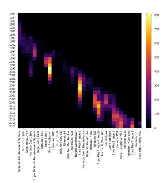
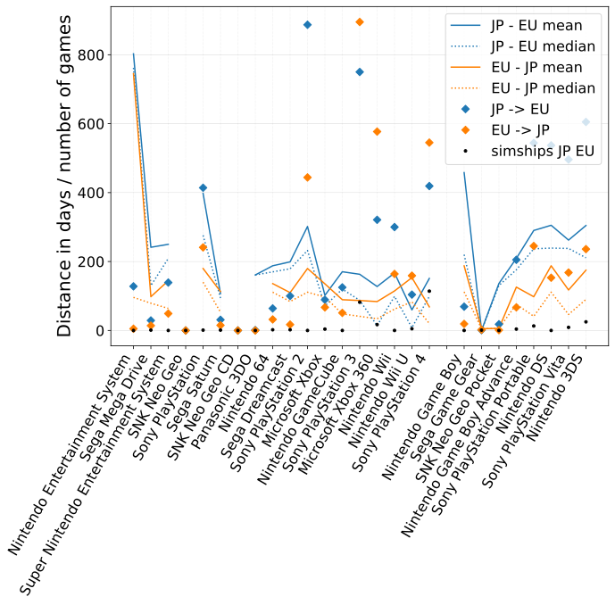
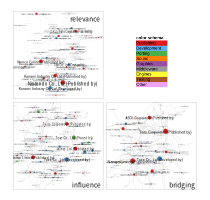
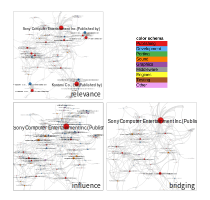

# Unboxing Japanese Videogames
This website supplements the publication [Unboxing Japanese Videogames (Martin Roth, MIT Press 2025)](https://mitpress.mit.edu/9780262552226/unboxing-japanese-videogames/), with high-resolution figures, data and tables, as well as interactive visualizations. 
To access the files, please visit the [GitHub repository](https://github.com/m4chi/UnboxingJapaneseVideogames) or use the links provided on this page.

This research was funded by the German Research Council (DFG) as part of the project [Databased Infrastructure for Global Games Culture Research](https://diggr.link/).

Access directly:
* TOC
{:toc}

## Book summary:
Unboxing Japanese Videogames uncovers the complex and plural spatialities of commercial videogames published in Japan between 1985 and 2015. Rejecting the “boxing” inherent in the phrase “Japanese videogames,” Martin Roth explores a series of spatialities that unfold in videogame production and distribution. The book develops a notion of spatialization that is applied in the analysis of contents or genre distributions in Japan, the US, the UK, Germany, and France, the distribution of videogame works across different important markets, the geography of actors involved in videogame production and their gradual spatialization over time, and the functional spatialization of game production across a diverse range of platforms.
This book is the first English-language study to provide an overview of the subject and also the first to explore the spatial history of FromSoftware games. It stands out because it does so quantitatively, offering a macro-perspective on the field of commercial videogames instead of relying on sales statistics or case studies. In addition to a wide range of related scholarship in English, the book engages actively with scholarship and other relevant resources in Japanese. Over thirty visualizations make the findings of the book tangible and invite the reader to explore the spatial complexity of commercial videogames further.

## 1 CAPTURING SPATIALIZATION

### Figure 1.01
**Heatmap of releases per platform, per year, based on the Media Arts Database**
	

A heatmap of releases per platform, per year, based on the Media Arts Database, showing the large extent to which game releases for platforms of different generations overlap temporally. Created by Florian Rämisch for the diggr project.  

### Figure 1.02
**Tangible spatialization processes and their various influencing factors**
	

A mindmap showing the relevant actors and factors that influence videogame spatialization in production and distribution, including directly involved actors and factors such as game companies, platform holders, and markets, as well as indirectly involved actors and factors such as state and regional governments or technological developments.  

## 2 CONTENTS

### Figure 2.01
**Distribution of “basic genres” per country for all videogame platforms**

Stacked bars indicating the relative distribution of the basic genres action, adventure, simulation, strategy and tactics, sports, racing and driving, role-playing, and puzzle in the United States, the United Kingdom, France, Germany, Japan and Worldwide releases, displaying a similar distribution in all countries except for Japan.  

### Figure 2.02
**Distribution of “narrative themes/topics” per country for all videogame platforms**

Stacked bars indicating the relative distribution of the narrative themes and topics detective, horror, adult, espionage, comedy, crime, romance and war in the United States, the United Kingdom, France, Germany, Japan and Worldwide releases, displaying a similar distribution in the United States, the United Kingdom and France, with a slight difference in the distribution in Germany and a more pronounced on in that of Japan.  

### Figure 2.03
**Distribution of “sports” per country for all videogame platforms**

Stacked bars indicating the relative distribution of the sports genres fishing, American football, baseball, basketball, hockey, golf, boxing, tennis, mixed sports, soccer, wrestling, skateboarding and snowboarding and skiing in the United States, the United Kingdom, France, Germany, Japan and Worldwide releases, displaying similarities between the European countries but otherwise diverse distributions.  

### Figure 2.04
**Share of “football (European) / soccer” per country over time for all videogame platforms**
Soccer_norm.svg)
Lines indicating the percentage of soccer games of all games per year between 1983 and 2018, in Japan, Germany, the United States, France, the United Kingdom, and Worldwide, showing several spikes in the 1990s and 2000s, and a general decline thereafter.  

### Figure 2.05
**Timeline for sports games per country over time for all videogame platforms**

Lines indicating the percentage of sports games of all games per year between 1983 and 2018, in Japan, Germany, the United States, France, the United Kingdom, and Worldwide, showing a spike across all markets in the late 1990s and a steep decline thereafter.  

### Figure 2.06
**Timeline for action games per country over time for all videogame platforms**

Lines indicating the percentage of action games of all games per year between 1983 and 2018, in Japan, Germany, the United States, France, the United Kingdom, and Worldwide, showing a spike across all markets in the late 1980s and relatively stable share of 40-50 per cent thereafter, which only declines slowly in the mid-2010s.  

### Figure 2.07
**Timeline for strategy / tactics games per country over time for all videogame platforms**

Lines indicating the percentage of strategy and tactics games of all games per year between 1983 and 2018, in Japan, Germany, the United States, France, the United Kingdom, and Worldwide, showing a larger share of 5-7.5 % in Japan in the 1980s and 1990s compared to the other countries, and a similar share of less than 5 % thereafter across all countries.  

### Figure 2.08
**Timeline for music / rhythm games per country over time for all videogame platforms**

Lines indicating the percentage of music and rhythm games of all games per year between 1987 and 2018, in Japan, Germany, the United States, France, the United Kingdom, and Worldwide, showing a higher share in Japan in the 1990s and early 2000s, followed by a peak in the other countries in the late 2000s, and a decline thereafter across all countries.  

### Figure 2.09
**Timeline for first-person shooter games per country over time for all videogame platforms**

Lines indicating the percentage of first-person shooter games of all games per year between 1984 and 2018, in Japan, Germany, the United States, France, the United Kingdom, and Worldwide, showing a lower share in Japan compared to the other countries across the entire period.  

### Figure 2.10
**Timeline for adventure games per country over time for all videogame platforms**

Lines indicating the percentage of adventure games of all games per year between 1985 and 2018, in Japan, Germany, the United States, France, the United Kingdom, and Worldwide, showing a higher share in Japan across the entire period.  

### Figure 2.11
**Timeline for role-playing (RPG) games per country over time for all videogame platforms**
_norm.svg)
Lines indicating the percentage of role-playing games of all games per year between 1986 and 2018, in Japan, Germany, the United States, France, the United Kingdom, and Worldwide, showing a higher share in Japan across the entire period.  

### Figure 2.12
**Timeline for visual novel games per country over time for all videogame platforms**

Lines indicating the percentage of visual novel games of all games per year between 1986 and 2018, in Japan, Germany, the United States, France, the United Kingdom, and Worldwide, showing a growing share in Japan since the mid-1990s, in contrast to a almost negligible share of less than 1 % in all other countries.  

### Figure 2.13
**Timeline for action role-playing games per country over time for all videogame platforms**
_norm_multi.svg)
Lines indicating the percentage of action role-playing games of all games per year between 1986 and 2018, in Japan, Germany, the United States, France, the United Kingdom, and Worldwide, showing a higher share in Japan across the entire period, and a spike in all countries in the early 2000s.  

## 3 MARKETS

### Figure 3.01
**Regional distribution of games published in JP region, platform level**

Ordered by platform release year for stationary (left) and handheld platforms (right). Solid lines indicate the share of releases per region. Dotted lines indicate share of first releases per region and simultaneous shipments (SIM) within a margin of seven days, diamond-shaped markers show the share of games not exclusively released in Japan.

Regional distribution of games published in JP region and share of first releases thereof for different platforms, ordered by platform release year for stationary (left) and handheld platforms (right), showing a noticeable difference between the two domains in terms of overlap across different release regions.

### Figure 3.02
**Overlap of games in the JP, EU, and US regions for selected platforms**

Venn diagrams indicating the overlap of games released in the  Japan, Europe and United States release regions for the Nintendo Entertainment System (top left), the Sony PlayStation (middle left), the the Sony PlayStation 3 (bottom left), and , the Nintendo Game Boy (top right), the Nintendo Game Boy Advance (middle right), and the Nintendo 3DS (bottom right).  

### Figure 3.03
**Mean and median delay from the first JP release to first US release and the other way around in days per platform, for all games with releases in the respective regions and correct release dates in the combined dataset**

Grouped by stationary (left side) and handheld (right side) platforms. Simultaneous releases, in this case only referring to exact date matches, are taken into account in both directions. The numbers of games for each direction (diamond shapes) and the number of simultaneous releases with exact date matches are indicated with black dots		
Mean and median delay from the first Japan release to the first United States release and vice versa for different platforms, ordered by platform release year for stationary (left) and handheld platforms (right).

### Figure 3.04
**Mean and median delay from the first JP release to first EU release and the other way around in days per platform, for all games with releases in the respective regions and correct release dates in the combined dataset**

Grouped by stationary (left side) and handheld (right side) platforms. Simultaneous releases, in this case only referring to exact date matches, are taken into account in both directions. The numbers of games for each direction (diamond shapes) and the number of simultaneous releases with exact date matches are indicated with black dots		
Mean and median delay from the first Japan release to the first EU release and vice versa for different platforms, ordered by platform release year for stationary (left) and handheld platforms (right).

### Figure 3.05
**Annotated release timeline of FromSoftware, including the first releases in JP, US and EU**
	
Release timeline of FromSoftware games in Japan (middle, red), Europe (bottom, green) and the United States (top, blue), showing the temporal delay between the first releases in each region for each game.
Play with the [interactive timeline](chapter3/Roth_Fig_03.05_FromSoftware_release_timeline_largerfonts.html).

### Figure 3.06
**Stacked number of releases per region for all FromSoftware games**

Stacked bars indicating the number of releases in different release regions for each game developed or published by FromSoftware.

## 4 SITES

### Figure 4.01
**Map of companies involved in the production of a sample of 475 videogames released in Japan between 1985 and 2015, split into three eras**

Three world maps with red location dots for all actors involved in the production of the sampled videogames in three corresponding periods, from 1985 to 1993, from 1994 to 2004, and from 2005 to 2015, based on the six console generations that emerged during this time. Created with python using Leaflet, OpenStreetMap, Folium, and CartoDB.

### Figure 4.02
**Close-up on Japan based on the sample data used in Figure 4.1, with a focus on Kansai and Tokyo in the most recent phase**

Three maps of Japan with red location dots for all actors involved in the production of the sampled videogames in three corresponding periods, from 1985 to 1993, from 1994 to 2004, and from 2005 to 2015. The Tokyo area and the Kansai area are exploded to provide more detail. The map for the first phase only covers the regions in Japan in which companies are located.

Play with the data in Figure 04.01 and 04.02 in this [interactive map](chapter4/Roth_Fig_04.01_02_interactive_SitesOfConsoleGameProduction_Worldmap_OSM_nodupl.html).

### Figure 4.03
**Company-based collaboration networks (giant component, reduced to actors with multiple contributions with edges cropped for better visibility)**

Production network visualizations for the Nintendo Entertainment System, and Sony Playstations 1, 3 and 4, with nodes colored according to the region in which the company headquarter is located in and node sizes based on number of games contributed to. Visualization created with Gephi.

Play with the interactive visualisations here:
[NES](https://ouestware.gitlab.io/retina/beta/#/graph/?url=https://gist.githubusercontent.com/m4chi/3c851b676023545ff026e2e299193207/raw/434ae495f134f22969d46cc06e165bdbf8b3890c/network-90e2877b-08e.gexf)
[PS](https://ouestware.gitlab.io/retina/beta/#/graph/?url=https://gist.githubusercontent.com/m4chi/2834a955d6f6e3fa583e51e016c7d142/raw/d8a5faf164824d1f4a6bf34e840fc3c804fd7b34/network-0545b84f-a2f.gexf)
[PS3](https://ouestware.gitlab.io/retina/beta/#/graph/?url=https://gist.githubusercontent.com/m4chi/95ac66032231fc349f5d08199e14965f/raw/399350e60eb1d22e18a31af3d21c05f0b793fa34/network-a2cb7287-be6.gexf)
[PS4](https://ouestware.gitlab.io/retina/beta/#/graph/?url=https://gist.githubusercontent.com/m4chi/8f0948962f7b61d153d4fe0fb12fe901/raw/1c62f8724ba82d73e3694873b3df98f71d202dd8/network-146e6a03-54b.gexf)

### Figure 4.04
**FromSoftware production networks in three phases**
	
Production network visualizations for FromSoftware games in three periods, 1994 to 2003, 2004 to 2013 and 2014 to 2019, with nodes colored according to the region in which the company headquarter is located, edges colored according to game titles. Node size based on weighted degree. Visualization created with Gephi.		

Play with the interactive visualizations here:
[early phase](https://ouestware.gitlab.io/retina/beta/#/graph/?url=https://gist.githubusercontent.com/m4chi/5ed954f9f677f2cb2602a7ba2f4c81b0/raw/2236aa8d4f8f50d0c8acfc4030171c84c180aaf5/network-769d0e4b-28f.gexf)
[mid phase](https://ouestware.gitlab.io/retina/beta/#/graph/?url=https://gist.githubusercontent.com/m4chi/e1d17d9eac3eb8f332200ed0b5d5a46e/raw/2236aa8d4f8f50d0c8acfc4030171c84c180aaf5/network-b05ac141-d5a.gexf)
[late phase](https://ouestware.gitlab.io/retina/beta/#/graph/?url=https://gist.githubusercontent.com/m4chi/1326bc430bdfef428ba16879f0b6e051/raw/2236aa8d4f8f50d0c8acfc4030171c84c180aaf5/network-b881810a-4b0.gexf)

## 5 ROLES

### Figure 5.01
**Relative role distribution across most relevant platforms for the Japanese market, based on the MobyGames release networks**

Bar diagram indicating the relative shares of different roles in the production process per platform for stationary and handheld platforms. The asterisk behind the platform name indicates handheld platforms. Miscellaneous tasks include any role with less than 2 % share.

### Figure 5.02
**Three perspectives on the NES production network, reduced to actors contributing to 3 or more games**

Three visualizations of the network of companies involved in videogame productions for the Nintendo Entertainment System, positioned based on relevance, influence and bridging, with nodes colored by role type.

Play with the interactive visualizations here:
[NES bridging](https://ouestware.gitlab.io/retina/beta/#/graph/?url=https://gist.githubusercontent.com/m4chi/fd22438785f341cd73fe5f5927093f1e/raw/9cf827465e33c5210b1bb5281bee9db7f886cbb9/network-94352f91-812.gexf)
[NES influence](https://ouestware.gitlab.io/retina/beta/#/graph/?url=https://gist.githubusercontent.com/m4chi/bde4a90597857ff6e3ca0c867bb06f77/raw/baa58bf1c5201a051d44ef2b628be37a51cc0f8d/network-acb98b5d-23f.gexf)
[NES relevance](https://ouestware.gitlab.io/retina/beta/#/graph/?url=https://gist.githubusercontent.com/m4chi/28488bf1b5bd644e096064ce7c08a173/raw/bb21b90616d88983b9a414add14789108b38e28b/network-5a5579b0-69c.gexf)

### Figure 5.03
**Three perspectives on the Sony PS production network, reduced to actors contributing to 3 or more games**

Three visualizations of the network of companies involved in videogame productions for the Sony PlayStation, positioned based on relevance, influence and bridging, with nodes colored by role type.

Play with the interactive visualizations here:
[PS relevance](https://ouestware.gitlab.io/retina/beta/#/graph/?url=https://gist.githubusercontent.com/m4chi/c3e20a521ffe244e2f253c0820fb1ff6/raw/acffeb765baf78f3e31c378f0adacd6f52b9110d/network-5b9c71a8-15b.gexf)
[PS influence](https://ouestware.gitlab.io/retina/beta/#/graph/?url=https://gist.githubusercontent.com/m4chi/168b4094cd201467b7f63acb7b9ca4d0/raw/c18926f9655b30b62f7947fac60d5ab1ab8eb49f/network-d193dafd-3af.gexf)
[PS bridging](https://ouestware.gitlab.io/retina/beta/#/graph/?url=https://gist.githubusercontent.com/m4chi/e31c1658df436c36b3000357b0d3dc71/raw/966351ee7af861618509e4fb8515ed5c20ecfb3f/network-63749a47-471.gexf)

### Figure 5.04
**Three perspectives on the Sony PS3 production network, reduced to actors contributing to 3 or more games**

Three visualizations of the network of companies involved in videogame productions for the Sony PlayStation 3, positioned based on relevance, influence and bridging, with nodes colored by role type.

Play with the interactive visualizations here:
[PS3 bridging](https://ouestware.gitlab.io/retina/beta/#/graph/?url=https://gist.githubusercontent.com/m4chi/15e78e93a6479006318525755386c15b/raw/f61b17860e5d5c2db31da68352e4f980fb396273/network-df7330e7-61c.gexf)
[PS3 influence](https://ouestware.gitlab.io/retina/beta/#/graph/?url=https://gist.githubusercontent.com/m4chi/b714ba0ec4929f3c1c011736b489ddf0/raw/df7029b2763e6e5dd9b1a98b57b5eb7956c24c3a/network-73c32651-456.gexf)
[PS3 relevance](https://ouestware.gitlab.io/retina/beta/#/graph/?url=https://gist.githubusercontent.com/m4chi/320be1e4db015b3608e559c3c73974df/raw/e97045d08909b1cb269e9416aa745951a4f9eb7f/network-32e7283c-b7b.gexf)

### Figure 5.05
**Three perspectives on the Sony PS4 production network, reduced to actors contributing to 3 or more games**

Three visualizations of the network of companies involved in videogame productions for the Sony PlayStation 4, positioned based on relevance, influence and bridging, with nodes colored by role type.

Play with the interactive visualizations here:
[PS4 relevance](https://ouestware.gitlab.io/retina/beta/#/graph/?url=https://gist.githubusercontent.com/m4chi/833d79708e38b028e456f8347a741479/raw/ce76e232f094d4e0a92809c23dbed0df68b4dce6/network-55baa099-22b.gexf)
[PS4 bridging](https://ouestware.gitlab.io/retina/beta/#/graph/?url=https://gist.githubusercontent.com/m4chi/e5273434412719df14927130d998ba39/raw/0c1d672bc3ee91c4e5aaf155410632e0a204abcf/network-588abfde-88e.gexf)
[PS4 influence](https://ouestware.gitlab.io/retina/beta/#/graph/?url=https://gist.githubusercontent.com/m4chi/50714b6afe1f995c2d060a70842feec1/raw/97a915e633e880445f98c9bfe0ece6308c6200f8/network-d5431963-fcb.gexf)

### Figure 5.06
**Heatmap of the count for each role per year and per period, divided by the number of games released in that period**

Heatmap of the number of times a role was involved in the production of a game per year for all FromSoftware games from 1994 to 2019.

### Figure 5.07
**Heatmap of the ratio of FromSoftware contributions to particular roles in each year**

Heatmap showing the share with which FromSoftware contributed to any specific role involved in the production process per year, for all roles mentioned from 1994 to 2019.

### Figure 5.08
**Network representation of the FromSoftware collaboration network, divided into three periods**

Production network visualizations for FromSoftware games in three periods, 1994 to 2003, 2004 to 2013 and 2014 to 2019, with nodes colored according to the role the respective actor had in the production process, node size based on weighted degree, edge colors represent different game works. Created with Gephi.

Play with the interactive visualizations here:
[early phase](https://ouestware.gitlab.io/retina/beta/#/graph/?url=https://gist.githubusercontent.com/m4chi/ae734ecbab497c5643e4ee844036180c/raw/eae9f1600ec3a64a249f7de87f2164d85205d808/network-7ed579f4-e63.gexf)
[mid phase](https://ouestware.gitlab.io/retina/beta/#/graph/?url=https://gist.githubusercontent.com/m4chi/9d20a8cb2722b76ae2fd370372b086b2/raw/eae9f1600ec3a64a249f7de87f2164d85205d808/network-13e44318-749.gexf)
[late phase LINK TO BE ADDED](). This network could not be exported via Export to the Web due to its size.  

## Meta
<!--- ADD! **Zenodo Repository Snapshots
 --->
**License**
[CC-BY 4.0](http://creativecommons.org/licenses/by/4.0)

**Copyright**
2025 Martin Roth [roth1003@fc.ritsumei.ac.jp](roth1003@fc.ritsumei.ac.jp)
